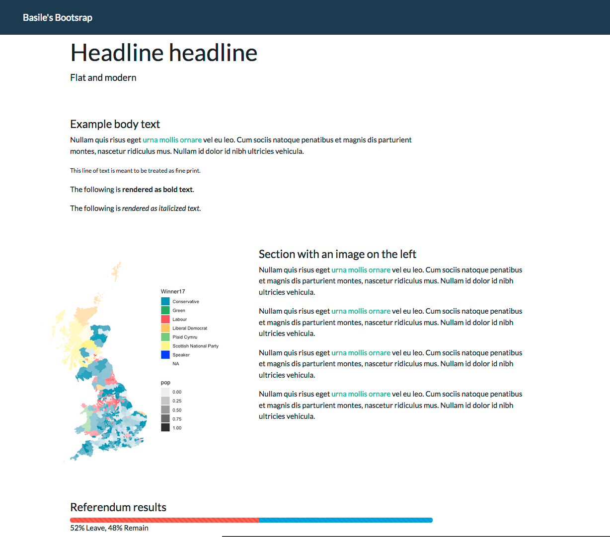

# Self-directed learning

## Recommended tutorials

* [Scraping Twitter data with twittR](http://utstat.toronto.edu/~nathan/teaching/sta4002/Class1/scrapingtwitterinR-NT.html): basic scaping and word analysis
* [Intro to rweet, word and semantic analysis](https://mkearney.github.io/blog/2017/06/01/intro-to-rtweet/): this uses the very good [rtweet package](https://cran.r-project.org/web/packages/rtweet/vignettes/intro.html)

## Tutorials on website building

Go through these four pages first, before looking at the contents of [`website-template`](website-template/)

* [Getting started with the web](https://developer.mozilla.org/en-US/docs/Learn/Getting_started_with_the_web)
* [Basics of HTML](https://developer.mozilla.org/en-US/docs/Learn/Getting_started_with_the_web/HTML_basics)
* [Basics of CSS](https://developer.mozilla.org/en-US/docs/Learn/Getting_started_with_the_web/CSS_basics)
* [Basics of Javascript](https://developer.mozilla.org/en-US/docs/Learn/Getting_started_with_the_web/JavaScript_basics)

---

# Other resources

### Wrangling data about the EU referendum

Head to [euref.org](euref.org)

### The 2017 general election

Head to [ge2017.R](ge2017.R)

### Mapping crime in London

Head to [police.R](police.R)

### Italian election poll of polls

Head to [italy-pop.org](italy-pop.org)
