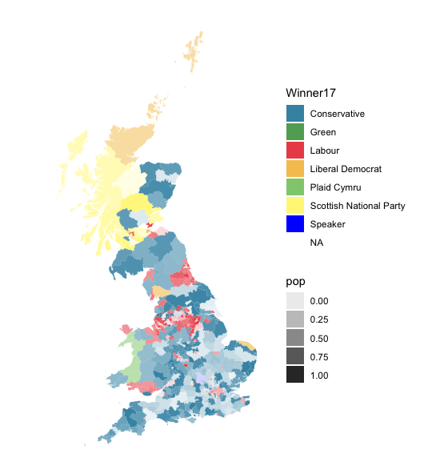

# Interactive Journalism MA - Advanced Data and Coding module

### Wrangling data about the EU referendum

Head to [euref.org](euref.org)

### The 2017 general election

Head to [ge2017.R](ge2017.R)

### Mapping crime in London

Head to [police.R](police.R)

### Italian election poll of polls

Head to [italy-pop.org](italy-pop.org)
