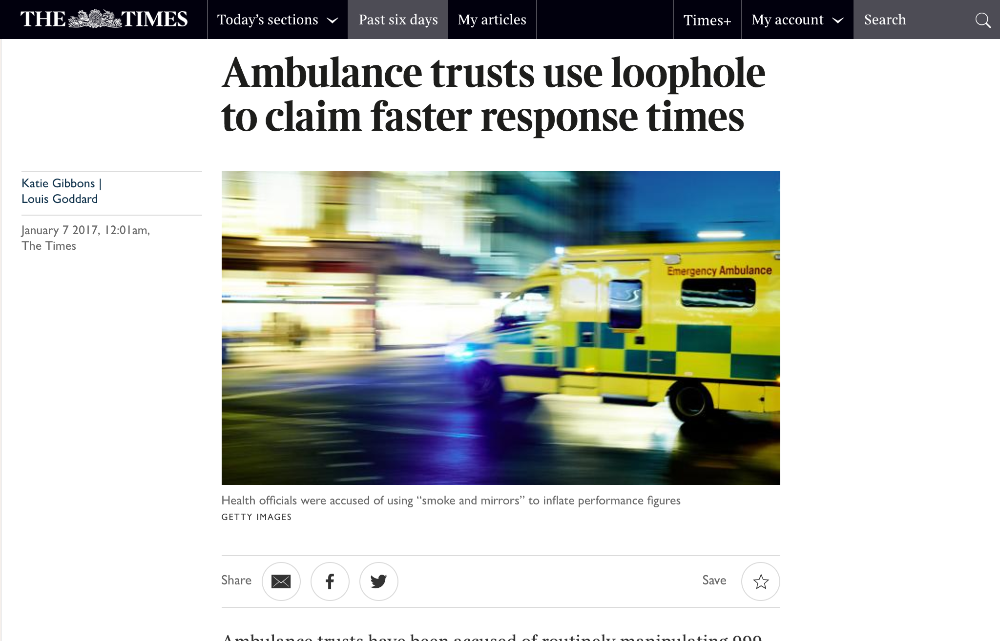
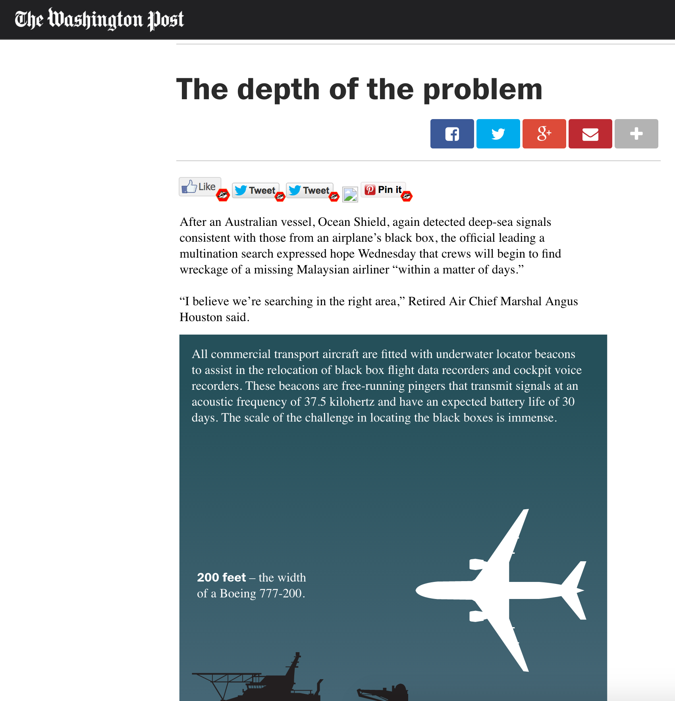
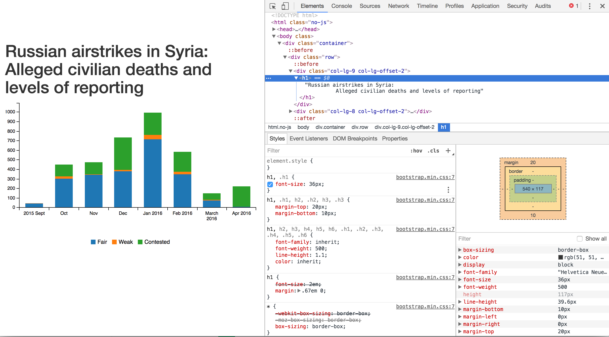

Interactive Journalism - Advanced Data & Coding module
========================================================

Module code: JOM299

- Module and assessment outline
- The self-learner attitude
- Useful resources
- Intro to the DevTools, the DOM, and debugging your things

Topics of this module
========================================================
### Scraping with Python  
Getting data from webpages through automation and programming  
[Scraping: definition (Wikipedia)](https://en.wikipedia.org/wiki/Web_scraping)

### Grammar of Graphics with R  
An elegant aproach to dataviz, and an intro to R  
[A Layered Grammar of Graphics, H. Wickham](http://vita.had.co.nz/papers/layered-grammar.pdf)

### Building charts for the web with D3  
Possibly the most important dataviz tool in the business  
[D3.js on Wikipedia](https://en.wikipedia.org/wiki/D3.js)

Module outline, aims. And a bit more
========================================================
Develop a complex skillset

Gain an understanding of data and of modern digital journalism

Have a crucial advantage over others in the industry

The self-learner attitude
========================================================
### The hacker ethic (Steven Levy)

* **Sharing**
* **Openness**
* **All information should be free**
* **Meritocracy**
* Decentralization
* Free access to computers
* Computers can change your life for the better

The self-learner attitude
========================================================
Engage in the community of data-journalists, news hackers and tinkerers

[Tips for self-learning (Hacker News)](https://news.ycombinator.com/item?id=13148319)  

[/r/dataisbeautiful community](https://www.reddit.com/r/dataisbeautiful/)  

[News Nerdery (Slack)](http://newsnerdery.org/)

RSS feeds, Twitter...

Assessment
========================================================

Total mark made of: 

## 25% oral presentation and brief (500 words) on week 4 
## 75% final project using digital skills

Minimum qualifying mark for both: 50

- UK credits: 15
- ECTS: 7.5

Assessment: Presentation (25%)
========================================================
All documents on Moodle

## 3-minute presentation in class
## 500-word brief

Assessment: Final Project(75%)
========================================================

It's about the story
========================================================

## Never forget this: it's *always* about the story you're telling

What you build and how you build it will follow your story

It's about the story
========================================================
title:false



<http://www.thetimes.co.uk/past-six-days/2017-01-07/news/ambulance-trusts-use-loophole-to-claim-faster-response-times-9mt7hgbp5>

It's about the story
========================================================
title:false



Massive scrollable image to illustrate how deep below sea flight MH370's black boxes could be located

<http://apps.washingtonpost.com/g/page/world/the-depth-of-the-problem/931/>

The DOM
========================================================

What is the DOM?   
<http://domenlightenment.com/#1.1>

**The DOM is a hierarchy/tree of Javascript node objects**

* It looks like the HTML you wrote
* It actually is the programming interface around it

The DOM
========================================================


```
<body>

  <article>
  
    <h1>This is a simple title</h1>

    <h1 id="special">This is another title... 
      <em>with a twist!</em>
    </h1>
    
  </article>
  
</body>
```

Let's have a look: <http://codepen.io/basilesimon/pen/PWNXEK>

The Dev Tools: the Swiss army knife of web work
========================================================

What you can do with Dev Tools:
- Edit the DOM directly
- Change styles of any page
- See Javascript code and errors
- See and edit any file loaded by the page

Access the Dev Tools
========================================================

On Chrome and Firefox
- `Ctrl` + `Shift` + `I` 
- or `Cmd` + `Opt` + `I` on a Mac


Dev Tools
========================================================
title: false



<https://airwars.org/data/russia-barchart/>

Do things with the Dev Tools
========================================================
Inspect and edit pages and style: <https://developers.google.com/web/tools/chrome-devtools/inspect-styles/>


The Dev Tools: edit HTML
========================================================

Example: make Donald Trump say anything with the Dev Tools!


The Dev Tools: hide some things
========================================================

Example: hide something

Homework
========================================================
* Fix these images: <http://codepen.io/basilesimon/pen/BQgwxG?editors=1100#0>  
* Hide DOM elements: <http://codepen.io/basilesimon/pen/PWjJwg>  
* Play with the dom: <http://discover-devtools.codeschool.com/chapters/1?locale=en>

