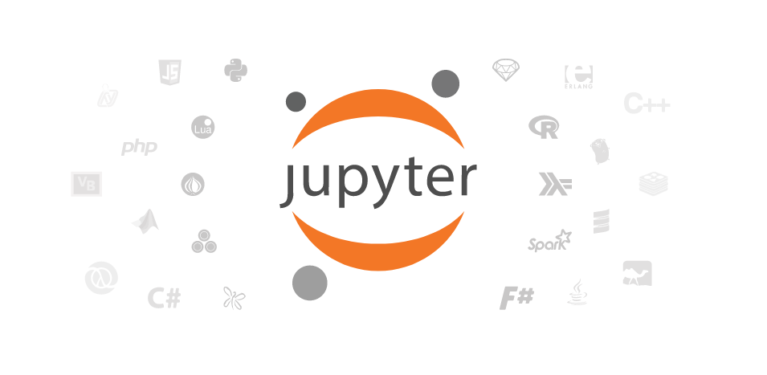

# 2.1: File formats, writing code

## file formats

as for scripts (instructions) and web pages, we sometimes need to store data in files ("datasets").

that's what you'd get from the ONS, data.gov.uk, an API, etc.

there are different file formats for different purposes.

## file formats: CSV

standing for Comma-Separated Values, CSV will be of much use to us when it comes to data.

    myfile.csv

think of a spreadsheet without any formatting: 

-   every line in the file is a row,
-   every comma-separated value is a cell

### CSV structure

    name, occupation, height
    basile, journalist, 187
    donald, politician, 188

## file formats: JSON

standing for JavaScript Object Notation, JSON is almost universally used on the web.

    myfile.json

structure in objects (\`var anObject = {};\`) separated by commas.
made up of \`key: value\` pairs.

### JSON structure

    var json = {
      "name": "Basile Simon",
      "occupation": "journalist",
      "friends": [ "pierre", "donald", "theresa"]
    }

    json.name => "Basile Simon"
    json.friends[0]` => "pierre"

<https://codepen.io/basilesimon/pen/MrZWZg?editors=1010>#

## JSON and CSV in this course

we're likely to store data when scraping, cleaning, etc. in CSV format.
we'll probably use, or "parse" CSV data into JSON for the web.

d3.js has a CSV parser: from the CSV above

    name, occupation, height
    basile, journalist, 187
    donald, politician, 188

we parse it as JSON, so we can run \`data.name\` and get "basile" back

## file formats: Excel, databases

Excel/ Google Spreadsheets are ****visual representations**** or CSV data

Databases come with, as the DOM does, their programming interface and language (eg SQL)

## a word about Python

## Python

Python is a programming language created in 1991.

It is the most taught programming language around the world.

### Why Python?

Newsroom use: <https://www.poynter.org/news/introduction-newsroom-programming-technologies>

Python is very easy to read and to use - and many newsrooms use it.

****If you can write Python, you can write anything.****

## What Python looks like

****Javascript****

    var foo = 'bar';
    function myFunction(parameter) {
      console.log(parameter);
    };

****Python****

    foo = 'bar'
    def myFunction(parameter):
        print(parameter)

## running your pythons: the notebook

Python also comes with a set of utilities bundled in a GUI: [the Jupyter Notebook](http://nbviewer.jupyter.org/github/jupyter/notebook/blob/master/docs/source/examples/Notebook/Notebook%20Basics.ipynb)

We can run Python notebooks from the university computers.

## data wrangling in Python

### white house visitors

### school earnings

## links

[A good notebook tutorial](https://plot.ly/python/ipython-notebook-tutorial/)
[Plots in Python with Plotly (easy)](https://plot.ly/python/getting-started/)
[An excellent notebook with scraping and plotting](http://nbviewer.jupyter.org/github/jvns/pandas-cookbook/blob/v0.1/cookbook/Chapter%205%20-%20Combining%20dataframes%20and%20scraping%20Canadian%20weather%20data.ipynb)
[Advanced data science methods](https://www.analyticsvidhya.com/blog/2016/01/complete-tutorial-learn-data-science-python-scratch-2/)

