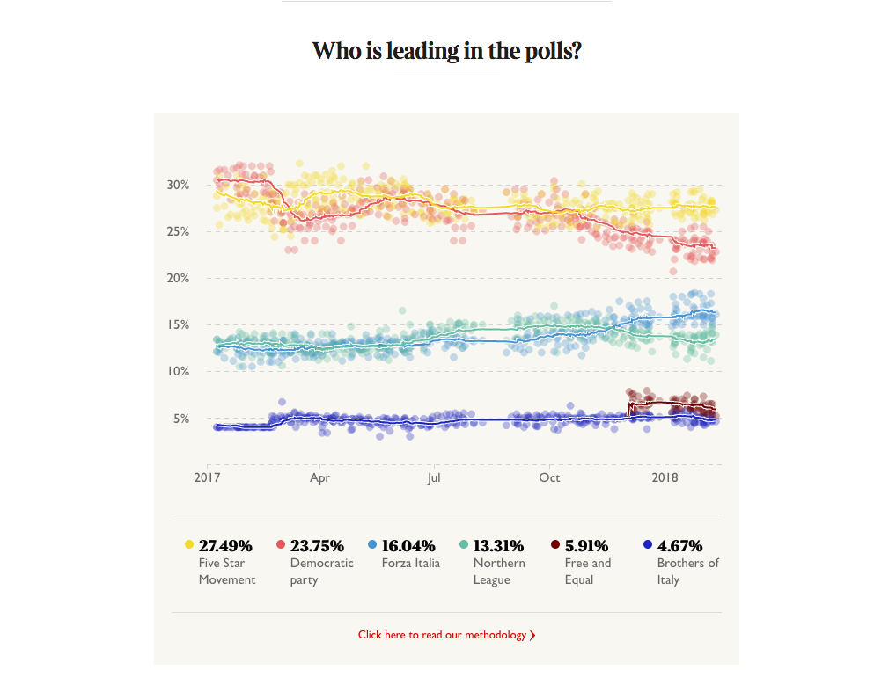
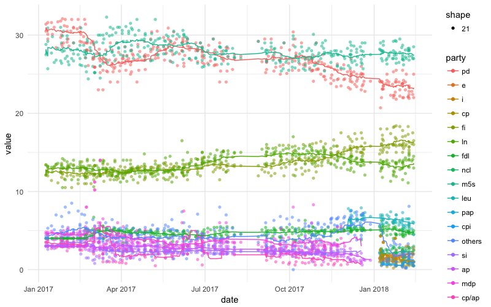

# 4.2: R in the newsroom: scrapin' and cleanin'

## the task

> We need a poll of polls for the Italian election. By yesterday, please, chop chop.

an editor who realises we're two weeks away from an election

## the output

### well, not quite&#x2026;

## the source

We need a data source for the polls.

There is an official source, which is an ASPX app that looked too daunting.

Easy-looking one: [a Wikipedia table](https://en.wikipedia.org/wiki/Opinion_polling_for_the_Italian_general_election,_2018#Graphical_summary)

So what do we have here?

-   a <table> element
-   several, actually!
-   contains all the polling from different institutes

## scraping the source

    # install.packages('rvest')
    library(rvest)
    
    url <- 'https://a-url.com'
    df <- url %>%
          read_html() %>%
          html_node(xpath="an/xpath/") %>%
          html_table()

### example

    url <- 'https://en.wikipedia.org/wiki/List_of_rampage_killers_(school_massacres)'
    url %>% read_html() %>%
       html_node(xpath='/html/body/div[3]/div[3]/div[4]/div/table[4]') %>%
       html_table() %>%
       View()

### problems for us

-   our columns are all messed up!
-   oh, also our numbers look like strings?!

## cleaning our data

-   our dates aren't going to be practical to work with
-   too many columns
-   not a tidy representation of data

****Rule of thumb for dates****: the closer to YYYY-MM-DD you are the easier it will be to convert to a proper date

### this horrible code

    mutate(cut_date = paste(tail(strsplit(date, "–")[[1]], n=1), " 2018")) %>%
    mutate(clean_date = as.Date(cut_date, format="%d %b %Y"))

    foo = "2-7 Feb"
    strsplit(foo, "-")[[1]]   -> list: ["2", "7 Feb"]
    tail(the_above), n=1)     -> "7 Feb"
    paste(the_above, " 2018") -> "7 Feb 2018"
    as.Date(the_above, format="%d %b %Y")  is a win!

### melting our data into tidy format

this is what we have:

<table border="2" cellspacing="0" cellpadding="6" rules="groups" frame="hsides">

<colgroup>
<col  class="org-right" />

<col  class="org-left" />

<col  class="org-right" />

<col  class="org-right" />

<col  class="org-right" />

<col  class="org-left" />
</colgroup>
<tbody>
<tr>
<td class="org-right">date</td>
<td class="org-left">firm</td>
<td class="org-right">party one</td>
<td class="org-right">party two</td>
<td class="org-right">party three</td>
<td class="org-left">etc</td>
</tr>

<tr>
<td class="org-right">2017-01-01</td>
<td class="org-left">ipso</td>
<td class="org-right">24</td>
<td class="org-right">32</td>
<td class="org-right">10</td>
<td class="org-left">n</td>
</tr>

<tr>
<td class="org-right">2017-01-02</td>
<td class="org-left">ipso</td>
<td class="org-right">22</td>
<td class="org-right">31</td>
<td class="org-right">9</td>
<td class="org-left">n</td>
</tr>
</tbody>
</table>

### melting our data into tidy format

this is what we want:

<table border="2" cellspacing="0" cellpadding="6" rules="groups" frame="hsides">

<colgroup>
<col  class="org-right" />

<col  class="org-left" />

<col  class="org-right" />
</colgroup>
<tbody>
<tr>
<td class="org-right">date</td>
<td class="org-left">party</td>
<td class="org-right">value</td>
</tr>

<tr>
<td class="org-right">2017-01-01</td>
<td class="org-left">one</td>
<td class="org-right">24</td>
</tr>

<tr>
<td class="org-right">2017-01-01</td>
<td class="org-left">two</td>
<td class="org-right">32</td>
</tr>

<tr>
<td class="org-right">2017-01-01</td>
<td class="org-left">three</td>
<td class="org-right">10</td>
</tr>

<tr>
<td class="org-right">2017-01-02</td>
<td class="org-left">one</td>
<td class="org-right">22</td>
</tr>

<tr>
<td class="org-right">2017-01-02</td>
<td class="org-left">two</td>
<td class="org-right">31</td>
</tr>

<tr>
<td class="org-right">2017-01-02</td>
<td class="org-left">three</td>
<td class="org-right">9</td>
</tr>
</tbody>
</table>

### the solution: melt()

[melt()](http://seananderson.ca/2013/10/19/reshape.html)

## visualising our data

\`ggplot\` is awesome.

    # install.packages('ggplot2')
    library(ggplot2)
    
    ggplot(data, aes( x = a_column, y = another_column )) +
      geom_point() +
      geom_bar()

dataset + aesthetics (which bit of the data goes where) + coordinate system + geometries

## adding value to our data to answer a question

> How well do we think these parties are doing, from these very different polls, and over time?

sounds like a job for avering things out.

### merging data

our two datasets having been prepared in the same way, with the same column names&#x2026; the merge is super easy:

    merge(dataframe_1, dataframe_2)

normally, you'd do:

    merge(dataframe_1, dataframe_2, by="id")

where "id" is a column the two datasets share (remember how we merged on the constituency names for the MPs, in Python&#x2026;)

### averaging

    rollapply(value, width = 20,
       fill = NA, partial = TRUE, 
       FUN=function(x) mean(x, na.rm=TRUE),
       align = "right")

## more

-   [dplyr tutorial](http://genomicsclass.github.io/book/pages/dplyr_tutorial.html)
-   [everything you could want to know about the tidyverse in a handy tutorial](https://tidyverse-intro.github.io/index.html)
