<!--<style>
.reveal .slides section .mediaInline img {margin: 0 auto; display: inline-block; width: 100%}
.reveal .slides section .mediaInline pre {margin: 0 auto; display: inline-block; width: 40%; font-size: 14px}
.reveal .slides section .mediaInline p {margin: 0 auto; display: inline-block; width: 50%}
</style>-->
Interactive Journalism - Advanced Data & Coding module
========================================================

Module code: JOM299

Assessment #1 + ggplot2

Presentations
========================================================
| name  | Fri 24  |
|---|---|
| Ryan Watts  | x  |
| Luke Barratt  |  x |
| Harriet Pavey  | x  |
|  Alex Ma | x  |
| Luke Mintz  |  x |
| Nell Mackenzie  | x  |
|  Kaye Wiggins | x  |
|  James Somper | x  |
|  Ayushman Basu | x  |
|  Amanda Lennon | x  |
|  Megan |  x |

Reminder
========================================================

> Pick one journalism piece/tool that illustrates a format or technique. Produce a presentation and report on the piece, how it's built, and the landscape of that format/technique in online journalism today.

# Rules

* 3 minutes
* 3 slides

This week: intro to ggplot2
========================================================

http://ggplot2.org/resources/2007-vanderbilt.pdf

dataset + geometries + coordinate system  
== all you need to make a chart!

This week: intro to ggplot2
========================================================

Let's load some CSV data:


```r
library(readr)
data <- read_csv("https://raw.githubusercontent.com/basilesimon/interactive-journalism-module/master/week5/exercise/data.csv")

library(ggplot2)
```

Basic plot
========================================================

We pass our dataset `data` and define the *aesthetics*: an x and y axis:


```r
basicChart <- ggplot(data, aes(x = Mean, y = Degrees)) +
  geom_point()
basicChart
```


Make the bubble size represent the number of people in this field
========================================================

```r
addWeight <- ggplot(data, aes(x = Mean, y = Degrees, size = Number)) +
  geom_point()
addWeight
```


Make the bubbles bigger by setting a maximum
========================================================

We can reuse the previous chart we built, simply adding a layer with the plus (+) sign:


```r
changeSize <- addWeight +
  scale_size_area(max_size = 15)
changeSize
```

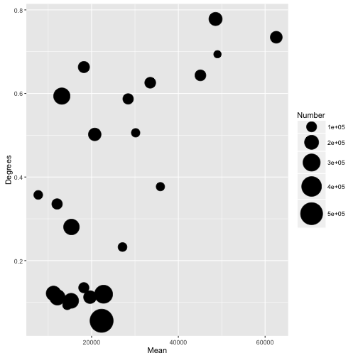

Add a progressive colour scale depending on the number of people
========================================================

That's a new property called *fill*. It will assign default colours for you.


```r
changeShape <- ggplot(data, aes(x = Mean, y = Degrees, size = Number, fill=Number)) +
  scale_size_area(max_size = 15) +
  geom_point(shape=21)
changeShape
```

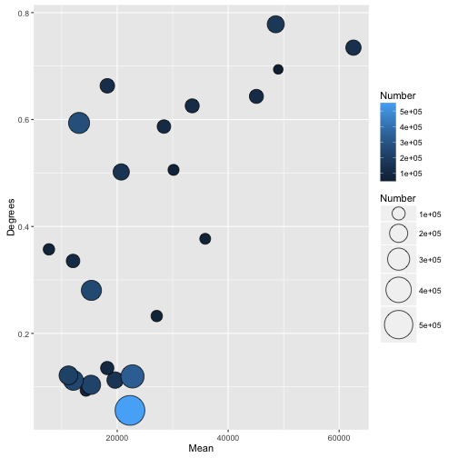

Make our axis prettier and more sensible
========================================================

Again, re-using our previous chart, we set two additional layers that apply to the axis:


```r
library(scales)
newAxis <- changeShape +
  scale_x_continuous(breaks = seq(0, 70000, 10000)) +
  scale_y_continuous(labels = scales::percent)
newAxis
```


A logarithmic y-axis, maybe?
========================================================

Useful for visualising extreme value differences: https://datavizblog.com/2013/03/26/how-to-visualize-data-with-extreme-value-differences/


```r
logScale <- newAxis +
  scale_y_continuous(labels = scales::percent, trans=log2_trans())
logScale
```

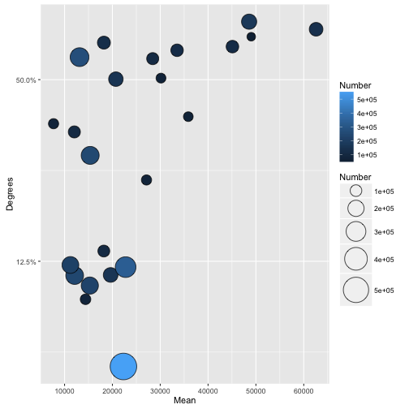

Add labels so we can see clearer... or not
========================================================

Note both the *label* property in the *aesthetics* and the `geom_text()` layer.


```r
labels <- ggplot(data, aes(x = Mean, y = Degrees, size = Number, fill=Number, label=Description)) +
  geom_point(shape=21) +
  scale_size_area(max_size = 15) +
  #scale_y_continuous(trans=log2_trans()) +
  geom_text(size = 2)
labels
```

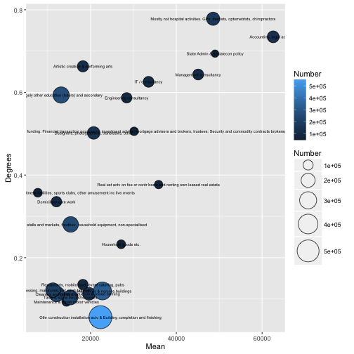

Let's load some annotated data (additional column)
========================================================

```r
data_annotated <- read_csv("https://raw.githubusercontent.com/basilesimon/interactive-journalism-module/master/week5/exercise/data_annotated.csv")
df <- data_annotated
```

Colour the privileged gigs depending on annotation
========================================================

```r
colors <- ggplot(df, aes(x = Mean, y = Degrees, size = Number, fill=Category)) +
  geom_point(shape=21) +
  scale_size_area(max_size = 15) +
  scale_x_continuous(breaks = seq(0, 70000, 10000)) +
  scale_y_continuous(labels = scales::percent, trans=log2_trans())
colors
```

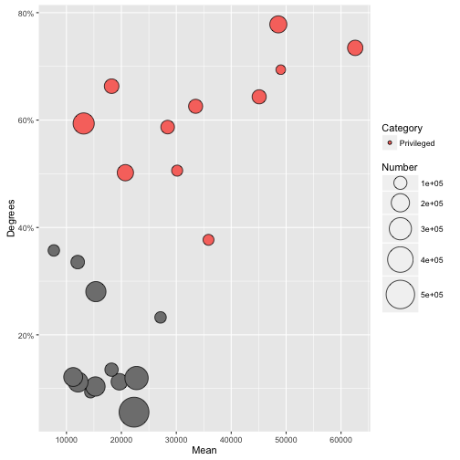

Add some text annotation to the plot
========================================================

We add two annotation layers with `annotate()`, with some x/y coordinates and which text to render.


```r
label <- colors + 
  annotate("text", x = 40000, y = .55, label = "Privileged gigs") +
  annotate("text", x = 20000, y = .2, label = "Precarious gigs")
label
```

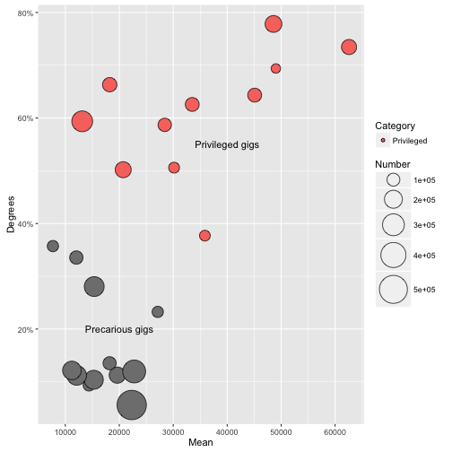

"Annotation are the core of what we do" - Amanda Cox
========================================================

```r
moreLabels <- colors +
  annotate("text", x = 31500, y = .05, label = "Construction and building") +
  annotate("text", x = 12000, y = .52, label = "Education") +
  annotate("text", x = 43500, y = .85, label = "Health sector") +
  annotate("text", x = 10000, y = .15, label = "Hairdressers") +
  annotate("text", x = 12000, y = .39, label = "Sports and recreation") +
  annotate("text", x = 21000, y = .7, label = "Arts") +
  annotate("text", x = 40000, y = .35, label = "Real estate") +
  annotate("text", x = 14000, y = .08, label = "Taxis") +
  annotate("text", x = 36000, y = .7, label = "IT and programming") +
  annotate("text", x = 48000, y = .59, label = "Consultancies") +
  annotate("text", x = 18000, y = .24, label = "Retail") +
  annotate("text", x = 58000, y = .85, label = "Legal and accounting")
moreLabels
```

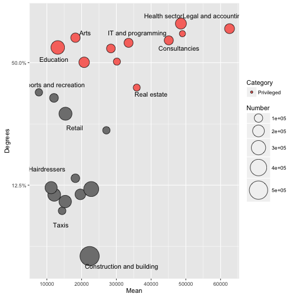

Fun with themes
========================================================

```r
library(ggthemes)
moreLabels + theme_minimal()
```

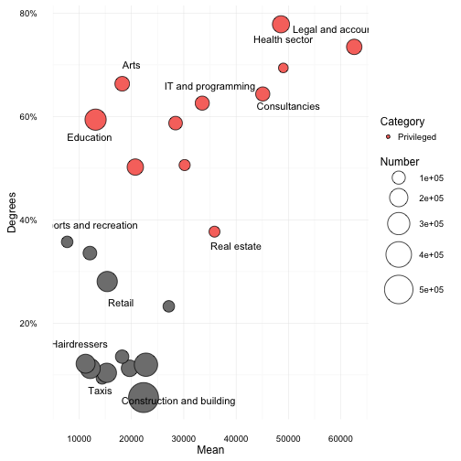

Fun with themes
========================================================

```r
moreLabels + theme_tufte()
```

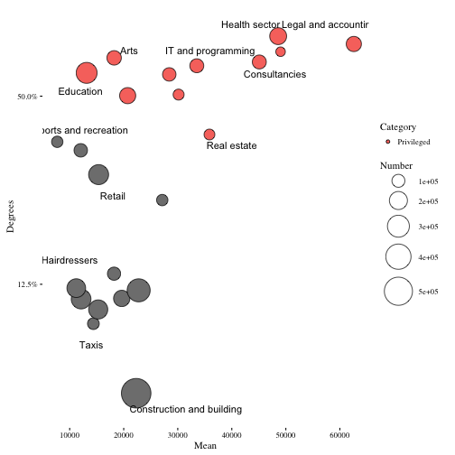

Fun with themes
========================================================

```r
moreLabels + theme_economist() + scale_colour_economist()
```

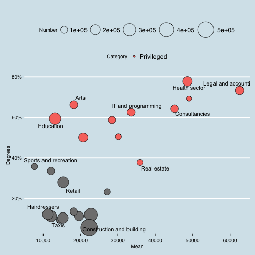

Fun with themes
========================================================

```r
moreLabels + theme_solarized() +
  scale_colour_solarized("blue")
```

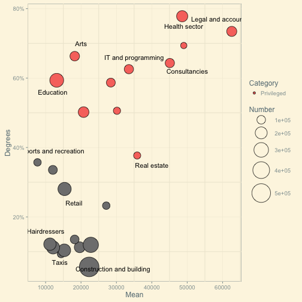

Facetting
========================================================

```r
colors + facet_grid(. ~ Category)
```

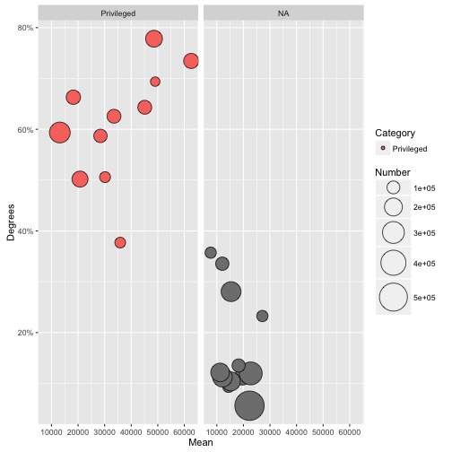

Reading and homework
========================================================

https://www.ted.com/talks/hans_rosling_shows_the_best_stats_you_ve_ever_seen

http://datadrivenjournalism.net/resources/when_should_i_use_logarithmic_scales_in_my_charts_and_graphs

https://www.datacamp.com/community/blog/the-easiest-way-to-learn-ggplot2#gs.QnUNY8Y
