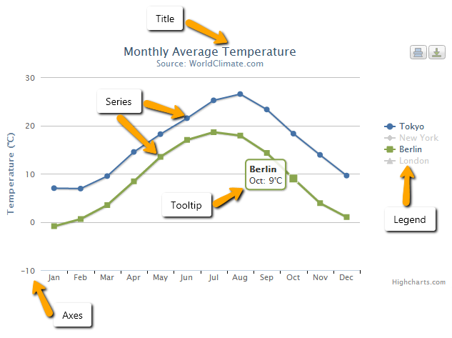

# 7.1: Javascript charts overview

## d3.js

> D3 allows you to bind arbitrary data to a Document Object Model (DOM), and then apply data-driven transformations to the document.

Source: d3js.org

### d3 selections

    var paragraphs = document.getElementsByTagName("p");
    for (var i = 0; i < paragraphs.length; i++) {
      var paragraph = paragraphs.item(i);
      paragraph.style.setProperty("color", "white", null);
    }

in d3 world:

    d3.selectAll("p").style("color", "white");

### familiarity

> D3’s vocabulary of graphical marks comes directly from web standards: HTML, SVG, and CSS.
> 
> D3 is easy to debug using the browser’s built-in element inspector: the nodes that you manipulate with D3 are exactly those that the browser understands natively.

[why build data viz with d3?](https://www.dashingd3js.com/why-build-with-d3js)

## what d3 code looks like

this "how to make a bar chart" tutorial, by d3.js co-creator [Mike Bostock](https://bost.ocks.org/mike/), contains everything you need to know.

let's have a look:

-   [part 1: selecting an element, using methods, scaling](https://bost.ocks.org/mike/bar/)
-   [part 2: loading data](https://bost.ocks.org/mike/bar/2/)
-   [part 3: rotating the plot, adding axes and scales](https://bost.ocks.org/mike/bar/3/)

## TODO how do I write d3 code?

1.  blockbuilder
2.  in files, obviously!

### blockbuilder

> The whole point of this project is to make it easier for you to make blocks. Blocks are the de-facto way of sharing visualizations and code samples in the d3.js community. Invented and hosted by Mike Bostock, blocks are key to realizing the power of examples.

### TODO writing code with a text editor

## popularity of the tool

[dataviz with (Python and) Javascript](http://kyrandale.com/static/talks/reveal.js/index_pydata2015.html#/) 

a (great!) online presentation at PyData London 2015

we could substitute Python for R, the pipeline would be similar.

## so, d3.js it is?

d3.js currently is the leading tool for dataviz online.

****however****

d3 is:

-   far too complicated for the time we've got
-   now a tool large newsrooms leave to specialists
-   for beginners, not the best tool to shine

### hard

d3 is ****hard****

You have to set up:

-   Your own canvas/ SVG container
-   Your axis and their domain and extent
-   The way you want to represent your data

There are few helpers to guide you!

You chart is nothing more than DOM elements you throw on a canvas.

-   A bar chart is rectangles of varied heights placed along an x-axis
-   A scatterplot is a bunch of elements with x/y coordinates
-   Areas must be calculated manually
-   And so must angles
-   X/Y depend on your scales: linear? timeseries? logarithmic?

## an alternative: Highcharts

<http://www.highcharts.com/products/highcharts>

### highcharts

-   Works everywhere + responsive
-   License is free for non-commercial
-   Many chart types and documented examples
-   Syntax is configuration-oriented
-   Handles tooltips, date axis&#x2026;
-   Export charts as images or SVG for embed
-   And probably much more&#x2026;

## our first Highcharts chart

<http://www.highcharts.com/docs/getting-started/your-first-chart>

What you need:

-   An HTML 

-   Some Javascript instantiating a charts on your 

[Example](http://jsfiddle.net/43tnpxc6/)

    $('#container').highcharts({
        series: [{
            type: 'bar',
            data: [5, 7, 3]
        }]
    });

### some vocabulary

source: Highcharts.com

### options

[How to set options? (documentation)](http://www.highcharts.com/docs/getting-started/how-to-set-options)

Javascript objects?!?

source: w3schools

### Series = your chart data

<http://www.highcharts.com/docs/chart-concepts/series>

Should remind you of lists and objects:

    [1, 2, 10, 42]

    {
      name: 'Point 1',
      y: 0
    },{
      name: 'Point 2',
      y: 5
    }

### Chart types

Highcharts allow you to build all kinds of charts:

<http://www.highcharts.com/docs/chart-and-series-types/chart-types>

Using series, we can combine chart types, eg a bar chart with a line on top:

<http://jsfiddle.net/gh/get/library/pure/highcharts/highcharts/tree/master/samples/highcharts/demo/combo/> 

### your turn

-   Simple bar chart: <http://jsfiddle.net/0nsqbr03/>
-   Simple area chart: <http://jsfiddle.net/kLgoq9vs/>
-   Complex x/y heatmap: <http://jsfiddle.net/etbx3L20/>

## Graphical alternatives

<https://plot.ly/create/>

<https://quartz.github.io/Chartbuilder/>

