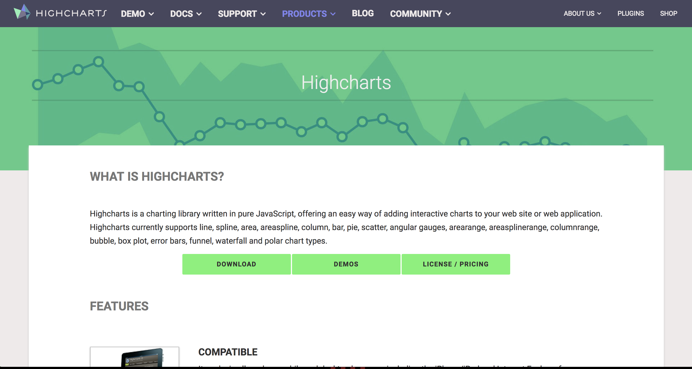
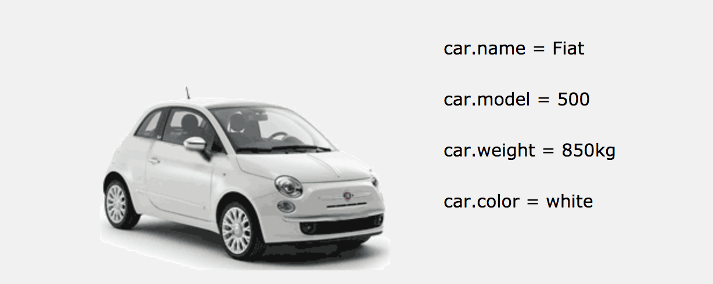

Interactive Journalism - Advanced Data & Coding module
========================================================

Module code: JOM299

Charting for the webz: alternatives to d3.js

"You may not need d3"
========================================================

Jerome Cukier, dataviz designer at Facebook

http://www.jeromecukier.net/blog/2015/05/19/you-may-not-need-d3/

(advanced knowledge of d3 ins and outs required)

"You may not need d3"
========================================================

In short:

* You can manipulate the DOM and styles without d3 (that's HTML/CSS and Javacscript selectors)
* Loading data in d3 can be replaced with XHR requests
* You can replace data joins, even if nazis say you can't
* Animations can be replaced by keyframes
* But d3 has loads of helped and shortcuts

Alternative: Highcharts
========================================================

http://www.highcharts.com/products/highcharts



Highcharts
========================================================

* Works everywhere + responsive
* License is free for non-commercial
* Many chart types and documented examples
* Syntax is configuration-oriented
* Handles tooltips, date axis...
* Export charts as images or SVG for embed
* And probably much more...

Highcharts
========================================================


_Image source: Highcharts.com_

First chart
========================================================

http://www.highcharts.com/docs/getting-started/your-first-chart

What you need:

* An HTML `<div>`
* Some Javascript instantiating a charts on your `<div>`

Example:

http://jsfiddle.net/highcharts/kh5jY/

Options
========================================================

http://www.highcharts.com/docs/getting-started/how-to-set-options

Javascript objects?!?



Image source: https://www.w3schools.com/js/js_objects.asp

Series
========================================================

http://www.highcharts.com/docs/chart-concepts/series

Should remind you of lists and objects:

```
[1, 2, 10, 42]
```

```
{
    name: 'Point 1',
    y: 0
},{
    name: 'Point 2',
    y: 5
}
```

Chart types
========================================================

Highcharts allow you to build all kinds of charts: 

http://www.highcharts.com/docs/chart-and-series-types/chart-types

Using `series`, we can combine chart types:

http://jsfiddle.net/gh/get/library/pure/highcharts/highcharts/tree/master/samples/highcharts/demo/combo/

Demos
========================================================

http://www.highcharts.com/demo

Highcharts
========================================================

Highcharts
========================================================
Chart.js
========================================================

http://www.chartjs.org/

http://jsfiddle.net/jsanz/uLUAT/

https://jsfiddle.net/milostimotic/e8n4xd4z/

http://jsfiddle.net/achudars/NXPhL/

Graphical alternatives
========================================================

https://plot.ly/create/

https://quartz.github.io/Chartbuilder/

